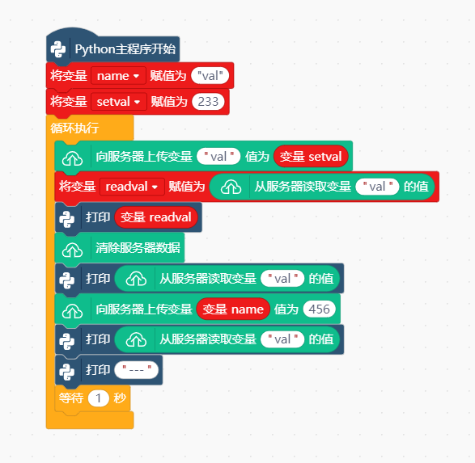
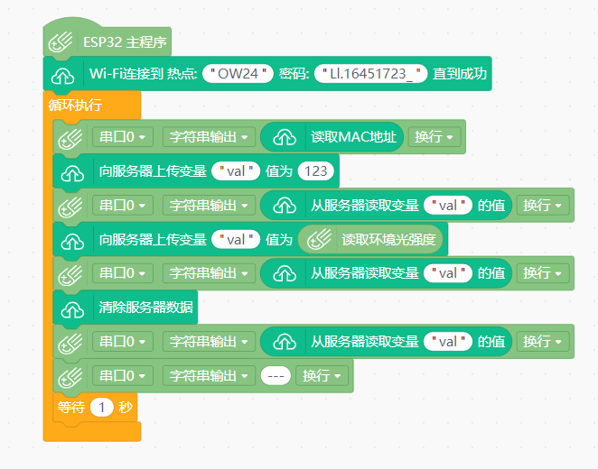

# Cloud Variable


---------------------------------------------------------

## Table of Contents

* [URL](#url)
* [Summary](#summary)
* [Blocks](#blocks)
* [License](#license)
* [Supported targets](#Supportedtargets)

## 链接
* Project URL : ```https://github.com/liliang9693/ext-CloudVariable```

* Tutorial URL : ```https://mindplus.dfrobot.com.cn/extensions-user```

    

## 简介
使用Mind+V1.7.2及以上版本，在Python模式用户库中加载此扩展，通过网络读写openblock的云变量。

## 积木列表


## 使用说明
### Python模式：
电脑或行空板，需要联网。  


### 上传模式：
需要先让板子联网。


## License

MIT

## 测试情况

MCU                | JavaScript    | Arduino   | MicroPython    | Python 
------------------ | :----------: | :----------: | :---------: | -----
arduino        |             |              |             | 
micro:bit        |             |              |             | 
esp32        |             |       √       |             | 
esp8266        |             |              |             | 
unihiker        |             |              |             | √
windows        |             |              |             | √
mac        |             |              |             | 

## 更新日志

* V0.0.1  基础功能完成
* V0.0.2  使用新接口方式，python及esp32完成，obloq未完成
